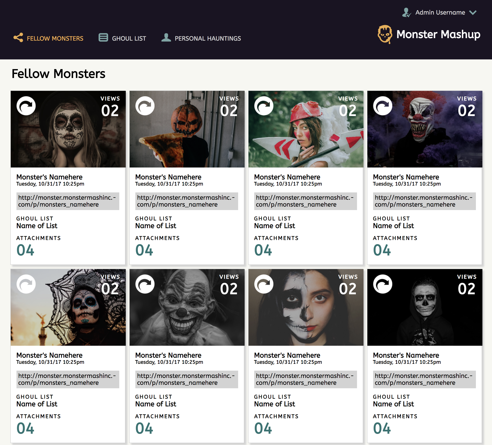
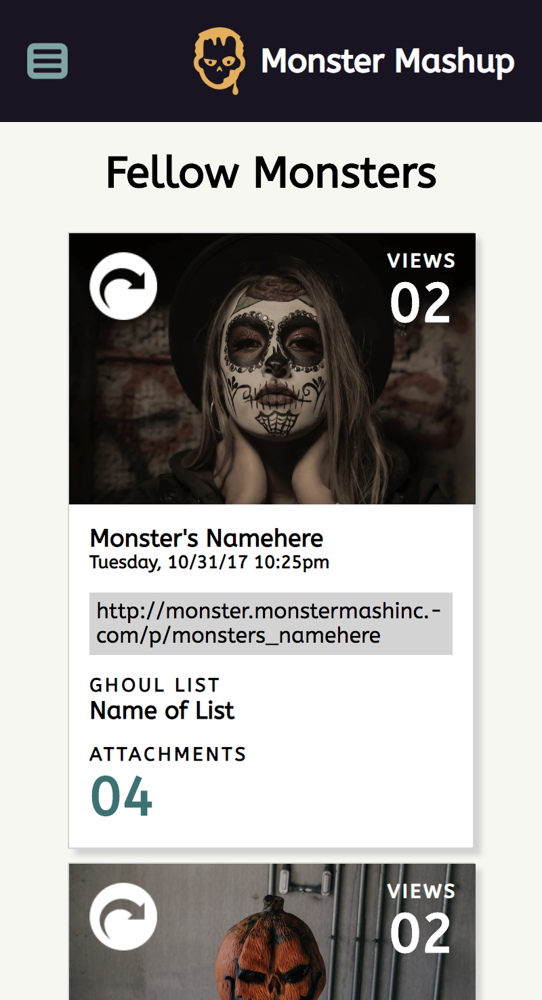

# Static Comp 1
ko-comp-challenge-1

This is a social media site for monsters. This static comp was completed as a Front-End Mod 1 project at Turing. This static comp was meant to work on recreating this [site](http://frontend.turing.io/projects/m1-static-comp-1.html) using a responsive layout and CSS Flex.

## Preview of Page
Webpage view on desktop:

Webpage view on mobile:

## Built With
This page was built using basic HTML and CSS, including CSS Flex.

## Authors
*Karin Ohman - 10/16/2018*
